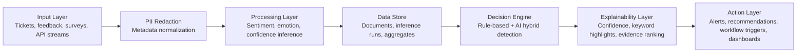

# Designing Explainable AI Decision Systems for Enterprise Workflows: A Practical Architecture Approach

## 1. Abstract
Artificial intelligence is increasingly used in enterprise operations to classify events, prioritize issues, and trigger workflow actions. However, many deployed systems still behave as black boxes, making it difficult for decision-makers to understand why a recommendation or alert was produced. This lack of transparency reduces trust, slows adoption, and creates operational risk in domains such as customer support, healthcare triage, and organizational monitoring. This paper presents a practical architecture for explainable AI decision systems that combines data ingestion, lightweight machine learning inference, rule-based decision logic, and evidence-centered explanation outputs. The proposed approach is implemented in the Enterprise AI Decision Support System (EADSS), a production-oriented prototype built with FastAPI, Celery, PostgreSQL, Redis, and a Next.js interface. EADSS accepts workflow events, redacts personally identifiable information, performs sentiment and emotion analysis, detects risk spikes, and returns confidence scores, keyword highlights, and ranked evidence supporting each alert. A prototype evaluation using synthetic enterprise communication data shows that the architecture can produce interpretable outputs with low response overhead while improving transparency for downstream users. The results indicate that practical explainability can be embedded into enterprise workflows without abandoning operational efficiency.

## 2. Introduction
Enterprises increasingly depend on AI systems to support decisions in customer service, employee support, compliance monitoring, and operational intelligence. These systems often classify messages, detect anomalies, and recommend actions faster than human teams can do manually. Despite these benefits, organizations hesitate to rely on AI outputs when the reasoning process is opaque. A model may label a support ticket as high risk or trigger an organizational alert, yet managers, analysts, and frontline operators may not understand what evidence produced that outcome.

The trust problem becomes more serious in workflow-driven environments. In healthcare support systems, an unexplained classification can affect triage priority. In customer support operations, an unexplainable escalation may waste resources or hide service failures. In enterprise wellbeing or HR-related monitoring, opaque emotional-risk predictions can create ethical and governance concerns. For these reasons, explainability is not only a desirable feature but a practical requirement for responsible deployment.

Conventional research on explainable AI often emphasizes model interpretation in isolation, while enterprise systems require explainability that is actionable within operational workflows. Decision-makers need more than a class label; they need a confidence estimate, traceable evidence, contextual signals, and workflow-ready outputs.

This paper proposes a practical architecture for explainable AI decision systems that integrates explainability directly into enterprise workflows through ingestion, inference, evidence generation, and action orchestration.

## 3. Problem Statement
Many enterprise AI deployments fail not because the prediction model is unusable, but because the surrounding system does not make decisions understandable or operationally reliable. Three problems are especially significant.

First, enterprise AI decisions often lack transparency. Users receive outputs such as "high risk," "negative trend," or "escalate this case" without visibility into the features, evidence, or reasoning signals behind them. This makes validation difficult and prevents domain experts from challenging or confirming system behavior.

Second, poor transparency directly undermines decision trust. Enterprise users are accountable for the actions taken after an AI recommendation. If a manager or analyst cannot justify why a recommendation exists, they are less likely to act on it, or they may over-rely on it without proper scrutiny. Both outcomes are undesirable.

Third, many explainability methods are not integrated with business workflows. Even when a model can produce scores or feature weights, those outputs are often detached from operational systems such as ticketing pipelines, dashboards, and alerting services. As a result, explanation remains a research artifact rather than a usable enterprise capability.

The core problem, therefore, is the absence of an end-to-end architecture that combines transparent AI inference, workflow-compatible decision logic, and explanation outputs that enterprise users can inspect and act upon.

## 4. Proposed System Architecture
The proposed architecture is designed around five layers that transform raw enterprise events into explainable workflow decisions.

### A. Input Layer
The input layer accepts enterprise events such as support tickets, feedback messages, survey responses, API submissions, and other text streams. Each item contains metadata including organization, team, channel, source, tags, and timestamp. Before storage, the system applies personally identifiable information redaction so that downstream AI processing operates on safer text representations.

### B. Processing Layer
The processing layer performs text-oriented analysis. In the current EADSS prototype, this includes sentiment detection, emotion labeling, and confidence estimation over redacted text. The architecture also supports asynchronous batch execution through worker processes so that ingestion and analysis can scale independently. Processed outputs are stored as inference records linked to the original document.

### C. Decision Engine
The decision engine combines AI-derived signals with explicit rule logic. Instead of relying only on a single model output, the system calculates aggregated emotional trends and detects risk spikes through robust statistics over recent baselines. This hybrid approach improves controllability because enterprise administrators can inspect and tune rule thresholds while still benefiting from AI-based feature extraction.

### D. Explainability Layer
The explainability layer translates raw AI outputs into human-inspectable reasoning artifacts. In EADSS, this layer includes sentiment labels, emotion categories, calibrated confidence scores, keyword-based highlights, and ranked evidence documents contributing to each alert. Explanations are attached to alerts and can be viewed alongside the underlying text and metadata. This supports both operational decision-making and auditability.

### E. Action Layer
The action layer converts explained decisions into workflow outputs. These include alerts, recommendations, dashboard updates, and workflow triggers that can be consumed by enterprise interfaces or downstream systems. Because explanations are attached at the action stage, users do not only see that an event occurred; they also see why it occurred.

Figure 1 illustrates the proposed architecture.

The architecture is intentionally practical: each layer can be deployed independently, yet the system still preserves traceability between raw input, AI inference, decision logic, and final workflow action.

## 5. Implementation
The proposed architecture is implemented in the Enterprise AI Decision Support System (EADSS), a containerized prototype for enterprise workflow monitoring and explainable decision support.

The backend is implemented using FastAPI rather than Laravel. REST endpoints support ticket ingestion, document retrieval, latest inference retrieval, alert listing, alert detail inspection, organizational registration, and usage monitoring. Celery workers process asynchronous inference and scheduled aggregation tasks, while Redis acts as the task broker and PostgreSQL stores operational and analytical data. A Next.js frontend provides dashboard views for trends, alerts, and evidence inspection.

During ingestion, incoming ticket text is passed through a redaction module that replaces emails and phone numbers before storage. Each redacted document is written to the `documents` table with organizational and workflow metadata. If inference is enabled, the system creates an inference run and enqueues a background task for emotion analysis. The current prototype uses a lightweight lexical emotion model to assign sentiment, emotion labels, and calibrated confidence values.

The database design separates documents, inference runs, document-level inferences, alert rules, alert events, alert evidence, and usage logs. This schema supports traceability from an enterprise action back to the exact document and inference result that contributed to it. Aggregation tasks compute daily emotional summaries, and the alerting engine detects negative-rate spikes against a rolling baseline. When an alert is created, the system selects the most relevant evidence items, computes contribution scores, and stores keyword highlights for explanation.

This implementation demonstrates that explainability can be embedded as a first-class architectural concern rather than added as a post hoc visualization.

## 6. Evaluation / Results
An initial prototype evaluation was conducted using the EADSS synthetic data generator, which produces enterprise-style ticket streams across channels such as email, chat, survey, API, and web. The generated texts contain varied emotional language and embedded fake personally identifiable information so that both redaction and inference behavior can be observed.

Three aspects were examined: classification behavior, explainability output, and processing overhead. For a local evaluation over 15 template texts derived from the synthetic generator, the current lexical emotion model achieved 0.80 sentiment accuracy and 0.67 label-overlap accuracy when compared against the intended template categories. Average inference latency for the model call was approximately 0.007 ms per text on the local environment, with a maximum observed latency of 0.066 ms for this micro-benchmark.

Beyond these numerical values, the system produced operationally meaningful explanation artifacts. Each stored inference included sentiment, emotion labels, and calibrated confidence. Alert investigations exposed ranked evidence documents, contribution scores, highlighted keyword spans, and baseline statistics including median trend level and robust z-score. These outputs improved the inspectability of alerts compared with a plain binary risk label.

Although the evaluation is small and prototype-oriented, the results indicate that the architecture can deliver low-latency explainable decisions suitable for enterprise workflow integration.

## 7. Discussion
The main strength of the proposed approach is that explainability is embedded into the operational pipeline rather than treated as a separate research layer. This makes the system more usable for enterprise environments where users need direct evidence, not only statistical interpretation. The hybrid design also offers practical governance benefits because explicit rule thresholds can be audited and adjusted without retraining the entire system.

However, the current prototype has limitations. The present emotion model is lightweight and lexicon-based, which constrains semantic coverage and may not generalize well to complex or domain-specific language. The evaluation is also limited in scale and relies on synthetic data, so broader validation on real enterprise datasets is required before strong performance claims can be made.

There are also ethical considerations. Even explainable systems can introduce bias if input data is unrepresentative or if emotional interpretation is oversimplified. In sensitive enterprise contexts, explanations must not create false confidence. There is therefore an important trade-off between explainability and model complexity: simpler systems may be easier to explain, while more advanced models may improve predictive power but require more careful interpretation and governance controls.

These issues suggest that explainable enterprise AI should be approached as a sociotechnical system involving model design, workflow design, privacy safeguards, and human oversight.

## 8. Conclusion
This paper presented a practical architecture for explainable AI decision systems in enterprise workflows and demonstrated its implementation through the EADSS prototype. The architecture combines event ingestion, privacy-aware preprocessing, AI inference, hybrid rule-based decision logic, and evidence-centered explanation outputs within a single operational pipeline.

The work matters because enterprise users need more than accurate predictions; they need decisions they can inspect, justify, and act upon. By attaching confidence scores, evidence rankings, keyword highlights, and baseline metrics to workflow alerts, the proposed system improves transparency and supports more trustworthy AI-assisted operations.

Future improvements include replacing the current lexical model with domain-adapted transformer models, evaluating the system on real enterprise datasets, integrating richer feedback loops for human validation, and extending explanation methods to multi-modal and cross-workflow decision settings.
